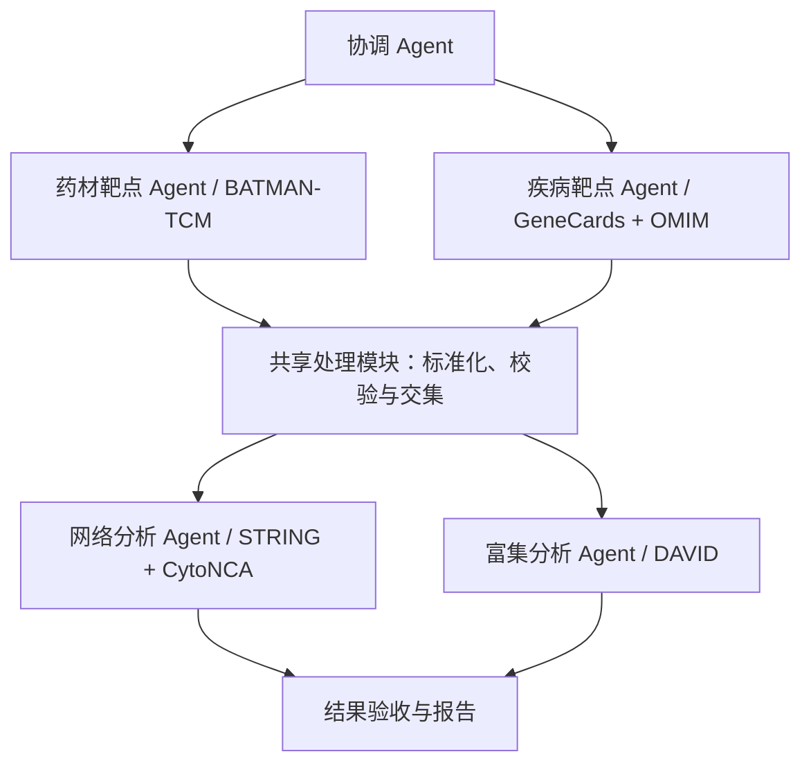

# Pharmacology Multi-Agent

面向药理研究的多 Agent 协作项目，连接 BATMAN-TCM、GeneCards、OMIM、STRING 与 DAVID，构建从药材成分与靶点获取、疾病靶点整合，到蛋白质相互作用网络及功能富集分析的可追溯流程。

项目通过任务分工、数据接口和执行记录，支持不同开发者独立实现模块，并逐步扩展至多方剂、多疾病分析。

> 当前已实现可运行的最小原型：独立 Codex 会话、Playwright 站点核验、数据交接、恢复重试和 Web 工作台。真实运行与合成工程验证分别标记；五库完整真实药理分析仍待数据、访问条件和统计口径确认。

## 快速启动

```powershell
& D:\Anaconda\envs\prim\python.exe server/app.py --port 8766
```

打开 [本机工作台](http://127.0.0.1:8766)。操作步骤见 [启动说明](docs/QUICKSTART.md)，组会展示见 [演示安排](docs/MEETING_DEMO.md)。

### 从页面提交研究任务

在右侧“新建任务”填写方剂或研究名称、药材、疾病关键词和可选研究说明。药材及疾病支持按行或逗号分隔。

- **保存任务**：写入 `tasks/tasks.jsonl`，可从左侧选择后执行；相同内容重复保存会复用同一任务。
- **保存并启动**：保存任务后调用现有执行器，启动独立 Codex Agent 会话。页面自动切到阶段详情，展示真实状态、工具事件和交接产物。
- **阶段详情**：点击中间任意流程节点即可查看；“新建任务”标签用于返回表单。

默认执行真实来源核验与分析，遇数据、账号或参数缺失时保留待处理状态。可在表单的“运行方式与已有数据”中选用合成工程验证；该模式使用固定测试集合，不会查询所填研究对象，也不产生真实药理结论。研究说明随任务传给各 Agent，运行仍遵循角色职责和数据验收约定。

保存与启动是两个步骤。若已有任务在运行，仍可保存新的研究任务；启动失败时已保存内容保留，可稍后从左侧执行。已有导出可填写导入批次，准备方式见 [IMPORTS.md](docs/IMPORTS.md)。账号、密码和验证码不填写到任务表单。

## 首轮验证范围

首轮 Demo 使用 **芍药甘草汤（白芍、炙甘草）× Hyperthyroidism（甲亢）**，验证数据库之间的数据衔接及多 Agent 协作机制。甲状腺疾病是首个应用案例，项目结构面向后续药理研究场景扩展。

主要交付包括原始数据及来源记录、规范化靶点清单、交集结果、PPI 网络与拓扑指标、GO/KEGG 富集结果，以及各 Agent 的执行和交接记录。

## 协作架构



Agent 负责执行任务、调用工具及反馈异常；中位数计算、去重、标识映射和集合运算由确定性程序完成。STRING 与 DAVID 使用同一份共同靶点清单，两个分析分支可在输入通过校验后独立执行。

## 文档导航

| 文档 | 内容 |
|---|---|
| [Agent 工作分配](docs/AGENT_ASSIGNMENTS.md) | 模块认领、职责、输入输出和验收条件 |
| [Demo 实施计划](docs/DEMO_PLAN.md) | 阶段安排、依赖关系与整体验收 |
| [数据交接约定](docs/DATA_CONTRACT.md) | 产物、状态、来源记录与交接字段 |
| [Codex 执行配置](docs/CODEX_RUNTIME.md) | CLI 参数、角色启动方式与本地配置要求 |
| [任务清单](tasks/tasks.jsonl) / [填写说明](tasks/README.md) | 待执行的方剂、疾病和分析参数 |
| [执行设置](configs/runtime.json) | Codex CLI、profile 名称、模型和思考强度，不含凭据 |

## 目录结构

```text
agents/         Agent 职责说明
tasks/          待执行的研究任务（每行一条 JSON）
configs/        可共享的执行设置，不存放研究任务或凭据
docs/           协作、接口与实施文档
pharm_demo/     调度、Codex 适配、来源检查和数据处理
scripts/        任务执行、环境检查和启动入口
server/         本机 Web 工作台
examples/       明确标注的合成工程验证输入
tests/          计算、交接和运行器验证
data/           原始导入与分步科学数据归档（运行生成，不提交）
runs/           每次执行的任务快照、状态、Agent 交接和浏览器记录（不提交）
reports/        可独立打开的 HTML 报告（按需导出，不提交）
local/          本机运行适配、认证副本和安装材料（不提交）
```

运行时按需创建 `data/`、`runs/` 和 `reports/`，分别保存原始及处理数据、执行记录和报告；这些目录默认不纳入版本控制。原始数据与完整运行记录不提交到仓库。

研究任务填写在 `tasks/tasks.jsonl`，Codex 执行设置在 `configs/runtime.json`；各成员本机的 `icrc` 服务配置和认证信息不随仓库分发。运行器同时读取任务和执行设置，再启动对应 Agent。

### runs/ 里面保存什么

正式目录名为 `runs/`。每次新执行创建独立 `run_id`；恢复同一次运行时，对需要重做的角色增加 `attempt_02` 等目录，保留此前文件。

```text
runs/
  .runner.lock                  当前执行锁，记录占用进程
  <run_id>/
    manifest.json               本次任务与执行设置快照、模式、状态、计数、阶段索引
    events.jsonl                按时间追加的调度、会话启动、工具调用与交接事件
    report.md                   本次运行的阶段总结和未解决事项
    coordinator_plan/           协调规划：一个独立 Agent 会话
      attempt_01/
    herb_targets/               药材靶点 Agent
      attempt_01/
        handoff.json            结构化交接：状态、结论、问题、产物及哈希
        execution.json          会话编号、模型、耗时及工具执行元数据
        targets.json            通过导入校验后产生的目标集合；缺数据时不会虚构
        input_snapshot/         本次使用的原始导入快照（存在导入时）
        sources/                HTTP 来源检查及原始响应（执行核验时）
        browser/                本角色的 Playwright 输出目录
          *.png                 页面截图
          console-*.log         浏览器控制台日志
          traces/               Playwright 操作记录
        prompt.txt              实际给 Agent 的任务提示词，仅本地诊断
        codex.events.jsonl      原始 Codex 执行日志，仅本地诊断
        stderr.log              运行错误输出，仅本地诊断
        response*.json          模型原始结构化响应与格式约束
    disease_targets/            疾病靶点 Agent，目录结构同上
    intersection/               确定性筛选与交集，没有独立模型会话
    network_analysis/           网络 Agent 的输入、网络、指标和交接
    enrichment_analysis/        富集 Agent 的核验、统计结果和交接
    coordinator_review/         协调验收：另一个独立 Agent 会话
  diagnostics/                  环境、站点、接口、浏览器与界面检查；不是正式研究结果
```

目录中的文件取决于实际执行的步骤；上图是常见产物结构，不代表每次运行都能取得目标集合或分析结果。`manifest.json` 中 `mode=fixture` 表示合成工程验证，`scientific_complete=false` 表示尚未完成真实研究分析。

`runs/` 按“哪次运行、哪个角色、第几次尝试”组织执行记录；`data/pharm/<方名>/01_batman/` 至 `05_enrich/` 按研究步骤保留真实执行证据与数据副本。后者也会保存受限状态，归档不等于研究完成。

离线报告通过 `scripts/export_report.py --run <run_id>` 生成到 `reports/<run_id>.html`。整个 `runs/` 默认被 Git 忽略；页面只提供经过允许的产物，提示词、原始模型日志、输入快照及 traces 不通过 Web 产物接口公开。分享材料时应检查具体报告或截图，不把本机认证与完整诊断目录一并发送。

## 参与开发

1. 阅读工作分配与数据交接文档，在分工表中认领模块；一人可承担多个模块。
2. 根据实际数据库返回结果核验格式，记录访问、登录及导出条件。执行工具统一使用 Codex CLI，加载各成员本地的 icrc profile，模型为 gpt-5.6-luna，思考强度为 medium；接入前统一任务接口。
3. 先实现模块的输入输出校验和最小流程，再接入 Agent 调度；向下游提供经过检查的交接清单。
4. 接口变更须同步更新文档并与上下游负责人对齐。开发示例应使用可公开或合成的小样本，明确标注其来源。

开发任务和验收口径详见 [Agent 工作分配](docs/AGENT_ASSIGNMENTS.md)。


环境安装、Playwright 冷启动设置和五站访问准备见 [环境准备与验收](docs/ENVIRONMENT_SETUP.md)。分步原始文件归档与批次导入见 [导入说明](docs/IMPORTS.md)。
