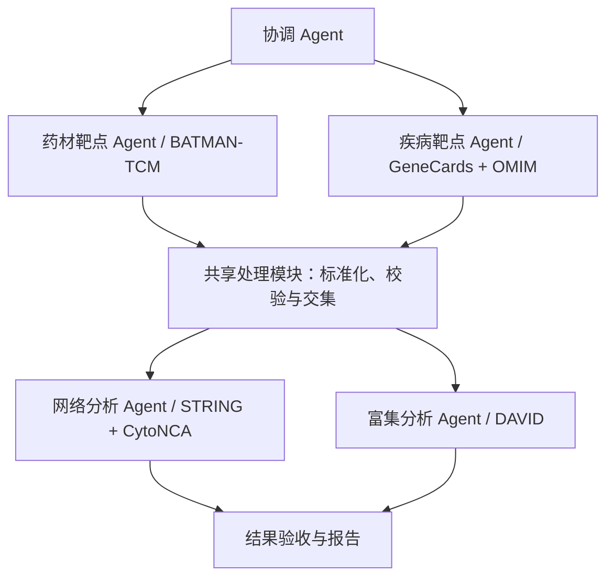

# Pharmacology Multi-Agent

面向药理研究的多 Agent 协作项目，连接 BATMAN-TCM、GeneCards、OMIM、STRING 与 DAVID，构建从药材成分与靶点获取、疾病靶点整合，到蛋白质相互作用网络及功能富集分析的可追溯流程。

项目通过任务分工、数据接口和执行记录，支持不同开发者独立实现模块，并逐步扩展至多方剂、多疾病分析。

> 当前处于设计与原型准备阶段：已建立角色说明、数据交接约定和示例配置；数据库连接、Agent 调度器及完整分析流程尚未实现或验证。目前没有可直接运行的端到端命令。

## 首轮验证范围

首轮 Demo 使用 **芍药甘草汤（白芍、炙甘草）× Hyperthyroidism（甲亢）**，验证数据库之间的数据衔接及多 Agent 协作机制。甲状腺疾病是首个应用案例，项目结构面向后续药理研究场景扩展。

主要交付包括原始数据及来源记录、规范化靶点清单、交集结果、PPI 网络与拓扑指标、GO/KEGG 富集结果，以及各 Agent 的执行和交接记录。

## 协作架构



Agent 负责执行任务、调用工具及反馈异常；中位数计算、去重、标识映射和集合运算由确定性程序完成。STRING 与 DAVID 使用同一份共同靶点清单，两个分析分支可在输入通过校验后独立执行。

## 文档导航

| 文档 | 内容 |
|---|---|
| [Agent 工作分配](docs/AGENT_ASSIGNMENTS.md) | 模块认领、职责、输入输出和验收条件 |
| [Demo 实施计划](docs/DEMO_PLAN.md) | 阶段安排、依赖关系与整体验收 |
| [数据交接约定](docs/DATA_CONTRACT.md) | 产物、状态、来源记录与交接字段 |
| [示例配置](configs/demo.json) | 首轮案例与分析参数，未确认项为 `null` |

## 目录结构

```text
agents/         Agent 职责说明
configs/        可共享的配置及示例
docs/           协作、接口与实施文档
scripts/        处理和调度程序的预留目录
```

运行时按需创建 `data/`、`runs/` 和 `reports/`，分别保存原始及处理数据、执行记录和报告；这些目录默认不纳入版本控制。当前 `scripts/` 为空。

## 参与开发

1. 阅读工作分配与数据交接文档，在分工表中认领模块；一人可承担多个模块。
2. 根据实际数据库返回结果核验格式，记录访问、登录及导出条件。模型与运行框架尚未确定，应在接入前统一接口。
3. 先实现模块的输入输出校验和最小流程，再接入 Agent 调度；向下游提供经过检查的交接清单。
4. 接口变更须同步更新文档并与上下游负责人对齐。开发示例应使用可公开或合成的小样本，明确标注其来源。

开发任务和验收口径详见 [Agent 工作分配](docs/AGENT_ASSIGNMENTS.md)。


