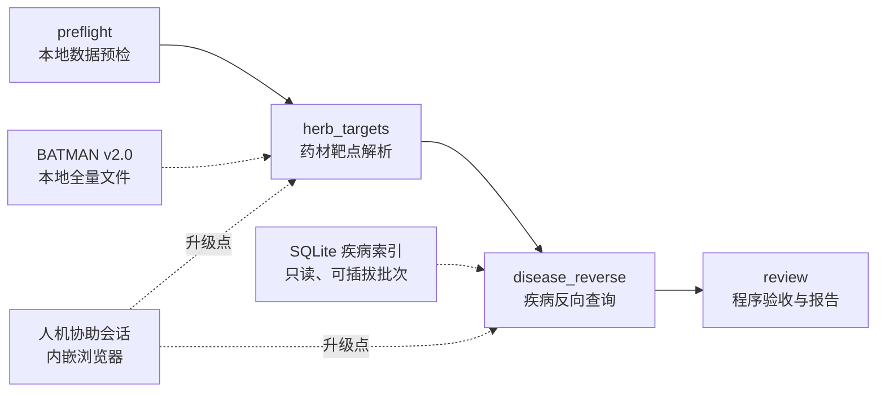

# Pharmacology Multi-Agent

中药复方 → BATMAN 本地成分/靶点 → 本地疾病索引反查候选疾病的可追溯研究工具。输入一个方剂（或自由药材组合），程序在本地数据中解析药材—成分—靶点关系，再用本地 SQLite 疾病索引反查"哪些疾病与这些靶点有关联"，输出候选疾病与逐条证据。

核心原则：**能本地化的全部本地化**——主链路是零模型会话的确定性程序；本地数据缺失时明确 blocked 并给出指引，不用合成数据顶替。在线采集（人机协助内嵌浏览器 + Agent）是预留升级方向，尚未实现。

## 快速启动

以下步骤面向首次克隆仓库的开发者，使用 **Windows PowerShell**，建议 Python 3.11。不需要任何研究数据、账号或模型服务即可完成 fixture 验证。

### 1. 获取项目并安装依赖

```powershell
git clone https://github.com/HappyLifeToCode/PharmacologyMultiAgent.git
cd PharmacologyMultiAgent
python -m venv .venv
.\.venv\Scripts\python.exe -m pip install --upgrade pip
.\.venv\Scripts\python.exe -m pip install -r requirements.txt
.\.venv\Scripts\python.exe -m playwright install chromium
```

命令直接使用项目内的虚拟环境，无需激活脚本。已有 Python 环境也可使用，替换解释器路径即可。

### 2. 启动工作台

```powershell
.\.venv\Scripts\python.exe server/app.py --port 8766
```

打开 [本机工作台](http://127.0.0.1:8766)。服务仅监听本机。也可使用 `scripts/start_demo.ps1`。

### 3. 用 fixture 验证流程（无需数据）

左侧"新建任务"选择一个内置方剂（如温经汤），运行方式选 **fixture（合成工程验证）**，点击"保存并启动"。数秒后四阶段全部 succeeded：中间栏阶段图变绿，点击"疾病反向查询"节点可在右栏看到候选疾病表与逐条证据。fixture 使用固定合成集合，全程不访问外网、不产生药理结论。

### 4. 真实数据运行（需要数据）

live 模式需要两项本地数据，缺失时对应阶段 blocked 并给出指引（不伪造数据）：

- **BATMAN-TCM v2.0 全量下载文件**：配置 `configs/batman_data.local.json`（模板 `configs/batman_data.example.json`）指向本机数据目录。
- **本地疾病索引**：用合格批次执行 `python -m pharm.discovery.query prepare --batch <批次目录>` 建立（批次格式见 [导入说明](docs/IMPORTS.md)）。

### 5. 测试

```powershell
.\.venv\Scripts\python.exe -m pytest tests/ -q
```

当前 119 项通过。测试不需要研究数据或外网（人机协助测试使用 headless Chromium）。

## 架构



- 四阶段固定 DAG（`pharm/pipeline/scheduler.py`），纯程序执行，manifest.json 是唯一状态源；参数即身份（task_id 为内容哈希）、代码即签名（resume 只复用输入/代码/数据/产物哈希全一致的成功阶段）。
- 本地数据缺失 → 阶段 blocked + guidance + `assist` 升级标记（工作台可启动人机协助会话）；blocked/failed 也是终态，下游如实记录，不顶替。
- 人机协助：headed Chromium 画面经 CDP screencast 推到工作台内嵌 canvas，鼠标键盘事件回传——用于未来"Agent 遇人机验证时由用户接管"的在线采集（Agent 采集流程本身尚未实现）。
- scientific_complete 恒为 false：关键词关联≠疗效，零结果如实保留。

## 目录结构

```text
pharm/            全部运行时代码
  core/           公共基础（路径/IO、归档、导入校验、符号校验）
  agents/         模型会话适配器（预留给在线采集，当前未被调用）
  batman/         BATMAN 本地数据查询、全药材目录扩展、内置四方剂组成表
  diseases/       GeneCards/OMIM 导出辅助与通用关联批次建库
  discovery/      疾病索引（建库/查询/目录）与反向查询
  assist/         人机协助浏览器桥（画面推流、输入回传、引导消息）
  pipeline/       任务模型、DAG 调度器、四阶段执行引擎
server/           本机 Web 工作台（FastAPI + 静态单页）
scripts/          任务执行、环境检查、报告导出入口
configs/          可共享执行设置与本机配置模板，不含凭据
tasks/            任务模板与填写说明；个人任务保存在 Git 忽略文件
docs/             协作、接口与实施文档
tests/            全部自动测试
data/ runs/ reports/ local/   运行生成或本机私有内容，默认不提交 Git
```

## 文档导航

| 文档 | 内容 |
|---|---|
| [完整文档导航](docs/README.md) | 阅读顺序与维护约定 |
| [项目进度与问题清单](docs/PROJECT_STATUS.md) | 已实现能力、缺口与下一步 |
| [启动与使用](docs/QUICKSTART.md) | 页面操作、恢复、离线报告 |
| [交接说明](docs/HANDOVER.md) | 架构、关键资产、已知坑、待办 |
| [反向查询与疾病索引](docs/REVERSE_DISCOVERY.md) | 索引口径、建库、查询接口 |
| [数据导入说明](docs/IMPORTS.md) | 两类批次的格式与校验纪律 |
| [数据交接约定](docs/DATA_CONTRACT.md) | 四阶段产物、状态语义、归档布局 |
| [环境准备](docs/ENVIRONMENT_SETUP.md) | 软件、浏览器与数据来源准备 |
| [Codex 执行配置（预留）](docs/CODEX_RUNTIME.md) | 在线采集阶段的模型会话配置 |
| [Agent 工作分配](docs/AGENT_ASSIGNMENTS.md) | 团队认领表（旧分工待重新认领） |
| [任务模板](tasks/tasks.example.jsonl) / [填写说明](tasks/README.md) | 任务字段与示例 |

## 历史

本项目此前是"药物×疾病交集分析"方向的多 Agent 系统（Venny 交集、STRING/CytoNCA 网络、DAVID 富集、甲状腺五病案例、六角色九阶段）。该方向已于 2026-09-22 重构废弃：相关代码（venny、string_local、cytoscape、david、supplement、audit 等）与文档已删除，完整实现与真实数据记录可从 Git 历史（重构起点 commit `6779567` 之前）查阅。当前方向为"方剂→靶点→疾病反向发现"。

## 参与开发

1. 阅读 [交接说明](docs/HANDOVER.md) 与 [数据交接约定](docs/DATA_CONTRACT.md)，在 [工作分配](docs/AGENT_ASSIGNMENTS.md) 中认领模块。
2. 直推 `main`；**push 前必须 `pytest tests/ -q` 全绿**。
3. 不编造数据、不用合成结果顶替、不绕过站点人机验证；接口变更同步更新文档并与上下游对齐。
