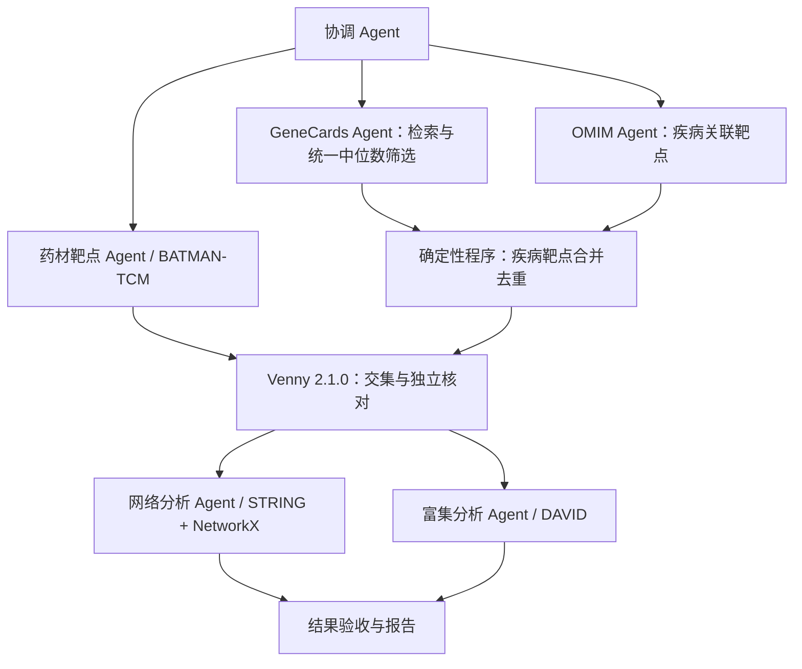

# Pharmacology Multi-Agent

面向药理研究的多 Agent 协作项目，连接 BATMAN-TCM、GeneCards、OMIM、STRING 与 DAVID，构建从药材成分与靶点获取、疾病靶点整合，到蛋白质相互作用网络及功能富集分析的可追溯流程。

项目通过任务分工、数据接口和执行记录，支持不同开发者独立实现模块，并逐步扩展至多方剂、多疾病分析。

> 截至 2026-09-14，已完成七个独立 Codex 会话、九阶段的合成工程演练，实际接入 Venny 2.1.0；CytoNCA 自动交接（桥接插件，非加权 Degree）与 DAVID 真实提交及 GO/KEGG 导出均已接入并通过工程验证，自动测试 95 项通过。五库完整真实药理分析仍未完成：上游真实导出与正式研究参数确认尚有缺口。详见 [项目进度与问题清单](docs/PROJECT_STATUS.md)。

## 快速启动

以下步骤面向首次克隆仓库的开发者，使用 **Windows PowerShell**。建议使用 Python 3.11；执行 Agent 还需要 Node.js（含 npm/npx）、兼容的 Codex CLI 和可用的模型服务。完整浏览器流程目前仅在 Windows 验证，尚未提供 macOS/Linux 的完整适配。

### 1. 获取项目并安装依赖

先安装 [Git](https://git-scm.com/downloads)、[Python](https://www.python.org/downloads/) 和 [Node.js LTS](https://nodejs.org/)，确保终端可以找到对应命令。

```powershell
git clone https://github.com/HappyLifeToCode/PharmacologyMultiAgent.git
cd PharmacologyMultiAgent
python -m venv .venv
.\.venv\Scripts\python.exe -m pip install --upgrade pip
.\.venv\Scripts\python.exe -m pip install -r requirements.txt
.\.venv\Scripts\python.exe -m playwright install chromium
```

命令直接使用项目内的虚拟环境，无需激活脚本或修改 PowerShell 执行策略。已有 Python 环境也可使用，将 `.\.venv\Scripts\python.exe` 换成该环境的解释器即可。

### 2. 配置 Agent 执行环境

按照 [Codex 执行配置](docs/CODEX_RUNTIME.md) 安装并配置兼容的 Codex CLI，确保 `codex --version` 和 `npx --version` 可运行。仓库默认使用 `icrc` profile、`gpt-5.6-luna` 模型和 `medium` 思考强度；这些是项目默认值，各成员需自行准备对应服务的访问权限，仓库不分发凭据。

当前适配器读取独立的 `<profile>.config.toml` 文件，不能仅凭普通 Codex 登录就直接运行。其他服务或模型需修改 `configs/runtime.json`，并按执行配置文档核验 CLI 与配置格式的兼容性。

```powershell
.\.venv\Scripts\python.exe scripts/doctor.py
```

检查输出中的依赖、Codex、npx、profile 和 Chromium 是否就绪。该检查仅核对本地环境，模型调用和数据库访问需在实际运行中验证。

### 3. 启动工作台

```powershell
.\.venv\Scripts\python.exe server/app.py --port 8766
```

打开 [本机工作台](http://127.0.0.1:8766)。服务默认仅监听本机，终端保持运行即可。也可使用 `scripts/start_demo.ps1`，它优先使用项目 `.venv`，否则使用当前环境的 `python`，支持 `-Python` 显式指定解释器。

页面查看和任务保存不需要调用模型；点击执行后才需要可用的 Codex 环境，合成工程验证也会调用模型。首次克隆没有历史运行数据，可先提交合成工程验证任务检查协作流程，再准备真实数据库账号、参数与导出。运行生成的 `data/`、`runs/`、`reports/` 默认不提交 Git。

后续操作见 [启动说明](docs/QUICKSTART.md)，展示流程见 [演示安排](docs/MEETING_DEMO.md)。

### 从页面提交研究任务

在左侧“新建任务”填写方剂或研究名称、药材、疾病关键词和可选研究说明。药材及疾病支持按行或逗号分隔。

- **保存任务**：写入 `tasks/tasks.local.jsonl`，可从左侧选择后执行；相同内容重复保存会复用同一任务。
- **保存并启动**：保存任务后调用现有执行器，启动独立 Codex Agent 会话。页面选择新运行并展示状态、工具事件和交接产物，左侧表单保持可见。
- **阶段详情**：点击中间任意流程节点，在右侧查看结果；左侧表单保持可见。产物文件点击直接下载，运行报告也提供下载入口。

“运行方式”默认选择“真实数据研究”，执行真实来源核验与分析，遇数据、账号或参数缺失时保留待处理状态。选择“测试数据演练”即合成工程验证：使用固定测试集合，不会查询所填研究对象，也不产生真实药理结论；两种模式都会调用 Agent。导入批次在“已有数据（可选）”中填写。研究说明随任务传给各 Agent，运行仍遵循角色职责和数据验收约定。

保存与启动是两个步骤。若已有任务在运行，仍可保存新的研究任务；启动失败时已保存内容保留，可稍后从左侧执行。已有导出可填写导入批次，准备方式见 [IMPORTS.md](docs/IMPORTS.md)。账号、密码和验证码不填写到任务表单。

## 首轮验证范围

首轮 Demo 使用 **芍药甘草汤（白芍、炙甘草）× Hyperthyroidism（甲亢）**，验证数据库之间的数据衔接及多 Agent 协作机制。甲状腺疾病是首个应用案例，项目结构面向后续药理研究场景扩展。

主要交付包括原始数据及来源记录、规范化靶点清单、交集结果、PPI 网络与拓扑指标、GO/KEGG 富集结果，以及各 Agent 的执行和交接记录。

交集步骤实际操作官方 Venny 2.1.0，保存原图、结果文本及访问记录，Python 只做独立核对。测试模式也需要访问 Venny；失败不会换成本地图继续执行。产物及失败规则见 [Venny 接入说明](docs/VENNY.md)。

## 协作架构



新运行包含六种 Agent 角色、七次独立模型会话及九个阶段。GeneCards 与 OMIM 独立并行，二者通过检查后才合并；任一路受限时，另一支的成功记录可保留并在输入不变时复用。疾病靶点合并由程序执行；交集由 Playwright 操作官方 Venny 2.1.0，再由 Python 独立核对。旧版运行保留原有流程与历史记录。

暂定 GeneCards 规则：合并本任务所有疾病的完整检索记录，统一计算 relevance score 中位数，严格筛选大于中位数的记录，再与 OMIM 合并去重。跨疾病同一基因的原始分数分别参与计算；确认状态为 `provisional`，待医生确认。

Agent 负责执行任务、调用工具及反馈异常；中位数计算、去重、标识映射和集合结果核对由确定性程序完成。STRING 与 DAVID 使用同一份共同靶点清单，两个分析分支可在输入通过校验后独立执行。

图中表示运行职责与依赖：网络阶段的 STRING 网络可来自在线 API 或显式配置的本地 v12.0 文件（`string_source="local_files"`），随后经桥接插件调用已装 CytoNCA 计算非加权 Degree，NetworkX 仅作独立核对且明确标注；DAVID 角色经新版工作台接口完成真实提交、背景选择与 GO/KEGG 导出，正式背景与统计口径未确认时保持受限。上游缺少合格导入时只做访问核验并保持受限，注册账号后仍需取得完整原始数据。

## 文档导航

| 文档                                                  | 内容                                |
|-----------------------------------------------------|-----------------------------------|
| [完整文档导航](docs/README.md)                            | 阅读顺序、文档更新与公开/本地约定                 |
| [项目进度与问题清单](docs/PROJECT_STATUS.md)                 | 已完成、未完成、历史访问限制及下一步                |
| [Venny 接入说明](docs/VENNY.md)                         | 实际浏览器交集、原图与核对、异常处理                |
| [Agent 工作分配](docs/AGENT_ASSIGNMENTS.md)             | 模块认领、职责、输入输出和验收条件                 |
| [Demo 实施计划](docs/DEMO_PLAN.md)                      | 阶段安排、依赖关系与整体验收                    |
| [组会演示手册](docs/MEETING_DEMO.md)                      | 新版双库并行演示、模式解释、离线准备与研究限制           |
| [数据交接约定](docs/DATA_CONTRACT.md)                     | 产物、状态、来源记录与交接字段                   |
| [Codex 执行配置](docs/CODEX_RUNTIME.md)                 | CLI 参数、角色启动方式与本地配置要求              |
| [任务模板](tasks/tasks.example.jsonl) / [填写说明](tasks/README.md) | 待执行的方剂、疾病和分析参数                    |
| [执行设置](configs/runtime.json)                        | Codex CLI、profile 名称、模型和思考强度，不含凭据 |

## 目录结构

```text
agents/         Agent 职责说明
tasks/          共享任务模板与说明；个人任务保存在忽略文件
configs/        可共享的执行设置，不存放研究任务或凭据
docs/           协作、接口与实施文档
pharm_demo/     调度、Codex 适配、来源检查和数据处理
scripts/        任务执行、环境检查和启动入口
server/         本机 Web 工作台
examples/       明确标注的合成工程验证输入
tests/          计算、交接和运行器验证
data/           原始导入与分步科学数据归档（运行生成，不提交）
runs/           每次执行的任务快照、状态、Agent 交接和浏览器记录（不提交）
reports/        可独立打开的 HTML 报告（按需导出，不提交）
local/          本机运行适配、认证副本和安装材料（不提交）
```

运行时按需创建 `data/`、`runs/` 和 `reports/`，分别保存原始及处理数据、执行记录和报告；这些目录默认不纳入版本控制。原始数据与完整运行记录不提交到仓库。

研究任务仅保存在本机 `tasks/tasks.local.jsonl`（Git 忽略，首次克隆为空），Codex 执行设置在 `configs/runtime.json`；各成员本机的 `icrc` 服务配置和认证信息不随仓库分发。运行器同时读取任务和执行设置，再启动对应 Agent。

### runs/ 里面保存什么

正式目录名为 `runs/`。每次新执行创建独立 `run_id`；恢复同一次运行时，对需要重做的角色增加 `attempt_02` 等目录，保留此前文件。

```text
runs/
  .runner.lock                  当前执行锁，记录占用进程
  <run_id>/
    manifest.json               本次任务与执行设置快照、模式、状态、计数、阶段索引
    events.jsonl                按时间追加的调度、会话启动、工具调用与交接事件
    report.md                   本次运行的阶段总结和未解决事项
    coordinator_plan/           协调规划：一个独立 Agent 会话
      attempt_01/
    herb_targets/               药材靶点 Agent
      attempt_01/
        handoff.json            结构化交接：状态、结论、问题、产物及哈希
        execution.json          会话编号、模型、耗时及工具执行元数据
        targets.json            通过导入校验后产生的目标集合；缺数据时不会虚构
        input_snapshot/         本次使用的原始导入快照（存在导入时）
        sources/                HTTP 来源检查及原始响应（执行核验时）
        browser/                本角色的 Playwright 输出目录
          *.png                 页面截图
          console-*.log         浏览器控制台日志
          traces/               Playwright 操作记录
        prompt.txt              实际给 Agent 的任务提示词，仅本地诊断
        codex.events.jsonl      原始 Codex 执行日志，仅本地诊断
        stderr.log              运行错误输出，仅本地诊断
        response*.json          模型原始结构化响应与格式约束
    genecards_targets/          GeneCards 独立会话、筛选口径与产物
    omim_targets/               OMIM 独立会话、关联靶点与产物
    disease_targets/            两路疾病靶点的确定性合并，没有独立模型会话
    intersection/               Venny 浏览器执行、原图与核对，没有独立模型会话
    network_analysis/           网络 Agent 的输入、网络、指标和交接
    enrichment_analysis/        富集 Agent 的核验、统计结果和交接
    coordinator_review/         协调验收：另一个独立 Agent 会话
  diagnostics/                  环境、站点、接口、浏览器与界面检查；不是正式研究结果
```

目录中的文件取决于实际执行的步骤；上图是常见产物结构，不代表每次运行都能取得目标集合或分析结果。`manifest.json` 中 `mode=fixture` 表示合成工程验证，`scientific_complete=false` 表示尚未完成真实研究分析。

`runs/` 按“哪次运行、哪个角色、第几次尝试”组织执行记录；`data/pharm/<方名>/01_batman/` 至 `05_enrich/` 按研究步骤保留真实执行证据与数据副本。后者也会保存受限状态，归档不等于研究完成。

离线报告通过 `scripts/export_report.py --run <run_id>` 生成到 `reports/<run_id>.html`。整个 `runs/` 默认被 Git 忽略；页面只提供经过允许的产物，提示词、原始模型日志、输入快照及 traces 不通过 Web 产物接口公开。分享材料时应检查具体报告或截图，不把本机认证与完整诊断目录一并发送。

## 参与开发

1. 阅读工作分配与数据交接文档，在分工表中认领模块；一人可承担多个模块。
2. 根据实际数据库返回结果核验格式，记录访问、登录及导出条件。执行工具统一使用 Codex CLI，加载各成员本地的 icrc profile，模型为 gpt-5.6-luna，思考强度为 medium；接入前统一任务接口。
3. 先实现模块的输入输出校验和最小流程，再接入 Agent 调度；向下游提供经过检查的交接清单。
4. 接口变更须同步更新文档并与上下游负责人对齐。开发示例应使用可公开或合成的小样本，明确标注其来源。

开发任务和验收口径详见 [Agent 工作分配](docs/AGENT_ASSIGNMENTS.md)。


环境安装、Playwright 冷启动设置和五站访问准备见 [环境准备与验收](docs/ENVIRONMENT_SETUP.md)。分步原始文件归档与批次导入见 [导入说明](docs/IMPORTS.md)。
