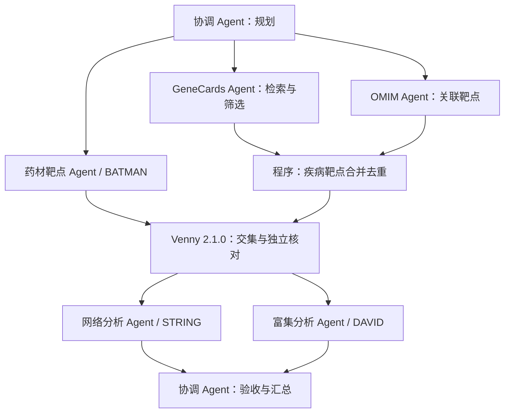

# Demo 协作与实施计划

当前流程版本为 `workflow_version=2`，实现药材与疾病共同靶点的主分析框架。六种 Agent
角色对应七个独立模型会话、九个阶段；疾病靶点由程序合并；药材/疾病交集通过官方 Venny 2.1.0 页面执行，程序独立核对。

## 数据流与依赖

药材分支与疾病分支同时执行；疾病分支内部的 GeneCards、OMIM 独立并行。GeneCards 完成筛选后，与 OMIM
通过检查的靶点集合合并；两路都通过检查才能生成统一疾病靶点。再与药材靶点取交集，交给网络和富集两个独立分析分支。

依赖图由执行器预先定义，协调 Agent 提供规划与验收意见；当前没有动态生成、增删节点或自动扩展研究流程的能力。规划返回问题后，执行器仍会尝试独立的来源工作。上游靶点缺失时，正式交集及分析受限，下游
Agent 可继续做站点入口核验。

## GeneCards 暂定筛选规则

当前约定适用于任务中填写的全部疾病关键词；五类甲状腺疾病为 Hyperthyroidism、Hypothyroidism、Thyroid cancer、Thyroid
nodules、Thyroiditis。

1. 收集全部所选疾病的完整 GeneCards 检索记录，保留每条记录的疾病、基因和原始 relevance score。
2. 合并这些记录计算一个中位数，严格保留分数高于中位数的记录。
3. 跨疾病同一基因的分数分别参与中位数计算，筛选后按基因去重；不预先取最大分数或平均值。
4. 将筛选后的 GeneCards 靶点与 OMIM 靶点合并，保留两库来源并去重。OMIM 不套用 GeneCards 分数筛选。

这项规则由用户暂定，尚待医生确认。任务字段为 `genecards_median_scope=pooled_query_rows`、`genecards_median_status=provisional`
；运行产物和报告保留口径。规则确认或调整后应新建任务或运行，历史结果不改写。详细输入要求见 [导入说明](IMPORTS.md)。

## 当前实现与待完成环节

| 环节               | 当前实现                                                | 后续工作                            |
|------------------|-----------------------------------------------------|---------------------------------|
| 输入与调度            | Web 保存任务、独立会话、固定依赖、并行及恢复                            | 在真实研究场景验证稳定性                    |
| BATMAN           | 站点核验、真实导入检查、关系与阈值筛选                                 | 完整查询导出、药材及炮制名称复核                |
| GeneCards / OMIM | 独立来源核验、独立导入及快照、筛选与合并                                | 完整真实数据获取、授权与口径确认                |
| 标识及交集            | 格式检查、精确去重、官方 Venny 2.1.0 交集与 Python 核对；导入需提供确认的映射依据 | 完整权威命名映射与歧义处理自动化                |
| 网络               | STRING 本地文件优先（API 回退）、NetworkX 度值和网络图；CytoNCA 桥接自动交接（非加权 Degree）已接入 | 真实研究网络的正式运行与拓扑指标口径确认 |
| 富集               | DAVID 真实提交、背景选择与 GO/KEGG 导出已接入；合成模式保留本地超几何检验/BH 校正 | 正式背景集与统计方法确认、真实输入运行     |
| 证据与报告            | 分阶段归档、哈希、事件、下载及离线报告                                 | 用完整真实输入完成科学验收                   |

任务入口为 `tasks/tasks.local.jsonl`
，也可在左侧“新建任务”填写。执行设置为 [configs/runtime.json](../configs/runtime.json)；默认 Codex
CLI、icrc、gpt-5.6-luna、medium，接入要求见 [Codex 配置](CODEX_RUNTIME.md)。

首轮选定的芍药甘草汤 × 甲亢是 Demo 案例，不是从原文方法段识别出的药材清单。甲状腺癌补充流程（独立癌症靶点网络 → 度值 Top
50 → 主要交集外候选靶点 → BATMAN 回溯成分与药材）已有独立 pipeline 并完成合成样本工程验证，真实输入待补；不能把当前主流程描述为已覆盖这部分研究，详见 [甲状腺癌补充流程](THYROID_SUPPLEMENT.md)。

## 验收与恢复

工程验收检查独立会话与真实并行、筛选计算、两路合并、单支失败后的恢复、来源隔离、分步归档及新旧页面兼容。合成模式的成功只证明工程流程；原文的
995、434、10 均不是验收目标数量。

科学验收要求完整原始导出、成分—靶点关系、映射依据、筛选流水账、共同靶点、真实网络与拓扑表、正式富集结果及完整统计参数。暂定规则不能被记录为科学分析已经完成。无交集或无显著富集应如实交付，不改阈值凑结论。

Venny 需保存官方原图、三个区域的结果文本及实际访问时间，并与独立 Python
集合核对一致。任一上游列表为空时当前适配器明确失败；两份非空列表交集为零则成功记录零交集并跳过下游。Venny
失败不得复用旧下游成功结果，详见 [Venny 契约](VENNY.md)。

截至 2026-09-13，最新完整合成演练九阶段通过，七个独立模型会话，43 项自动测试通过。该证据不包含完整真实五库导出，亦不是多
Agent 优于单 Agent 的对照实验。按模块的缺口与访问问题统一见 [项目进度](PROJECT_STATUS.md)。

失败分支新建 attempt，成功分支仅在任务、代码、输入和产物哈希一致时复用。仅更新 OMIM 的来源文件与台账不会使 GeneCards
分支失效；共同映射、参数或代码变化仍会触发复核。旧版七阶段运行保持旧图和旧执行路径；若需使用双库并行流程，应创建新运行。
