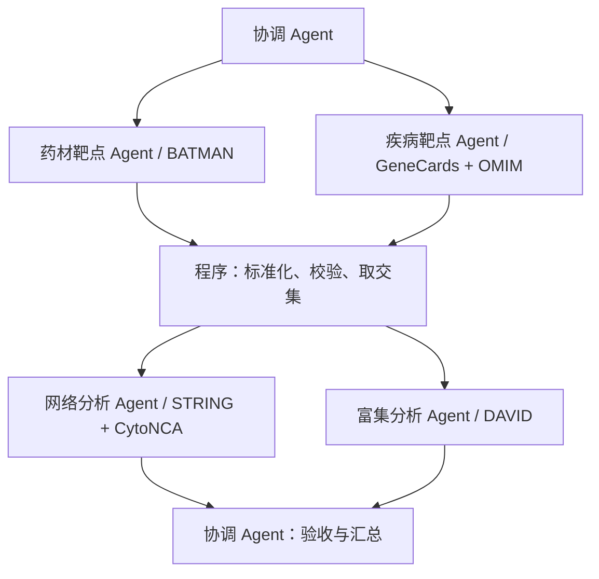

# Demo 协作与实施计划

## 数据流

协调 Agent 根据依赖调度，验证交付清单和错误状态，必要时携带具体问题退回负责 Agent。角色文件只是设计，必须接入真实会话和工具后才能声称多 Agent 已实现。

任务入口为 [tasks/tasks.jsonl](../tasks/tasks.jsonl)，执行设置为 [configs/runtime.json](../configs/runtime.json)。运行器读取任务内容后，结合角色职责分配具体工作。

## 实施顺序

1. 核验五库的实际入口、登录、查询、版本、导出能力，以及本机已有环境；保留访问记录。
2. 获取首轮案例的原始结果，明确 BATMAN 药材名称匹配及置信度阈值，验证 GeneCards 完整结果可获得性；确认 OMIM 基因关联提取口径。
3. 依据实际导出格式实现读取、基因规范化、筛选、合并和交集；先验证数据接口，不提前猜测页面字段。
4. 接入独立 Agent 会话、调度和交接日志，完成两路采集到交集的真实协作。
5. 接通 STRING/CytoNCA 与 DAVID；记录人类物种、网络阈值、额外节点设置、背景集和统计方法。
6. 完整运行并检验断点续跑，生成报告与协作过程展示。

执行工具已选定 Codex CLI，使用本地 icrc profile、gpt-5.6-luna 模型和 medium 思考强度。每个角色由独立任务会话执行，参数显式传入，见 [Codex 执行配置](CODEX_RUNTIME.md)。网页工具接入、调度器与真实运行仍待实现和验证。

## Demo 验收成果

- 原始导出及来源台账。
- 药材—成分—靶点关系、疾病靶点、映射记录、过滤前后数量。
- 共同靶点名单与韦恩图。
- STRING 网络、Cytoscape/CytoNCA 拓扑表及网络图。
- GO BP/CC/MF、KEGG 完整结果与筛选结果，明确检验、背景集及 BH 校正字段。
- 报告：输入、步骤、数量变化、结果及限制。
- 协作证据：每个 Agent 的任务、工具操作、输出、交接和实际发生的异常处理；不得编造失败场景。

业务验收与协作验收分别记录。真实无交集时停止依赖分析并说明原因；无显著富集时报告零显著项，不挑改阈值凑结论。研究分析产生机制线索，不能仅凭网络和富集证明药效。
